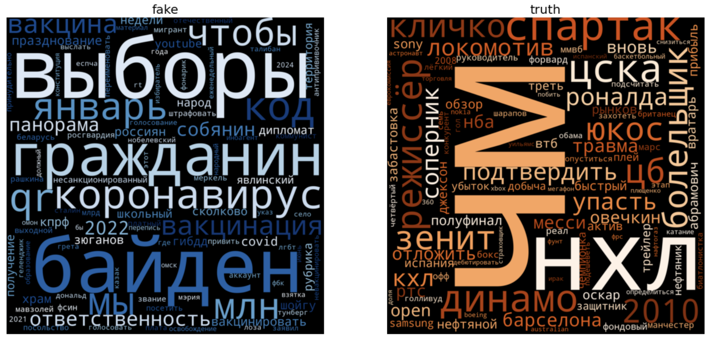
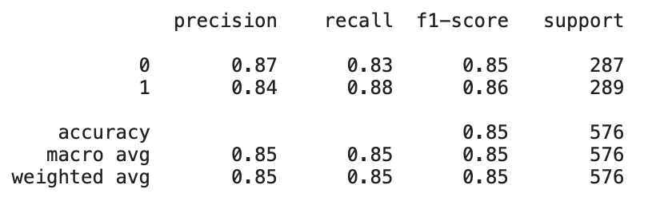
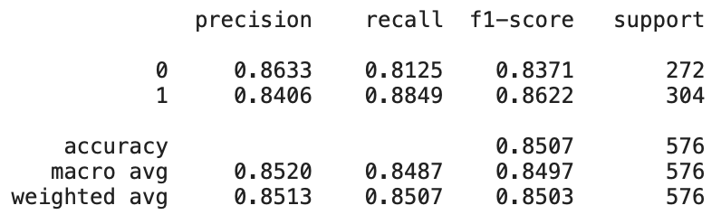
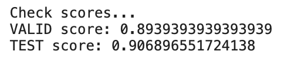
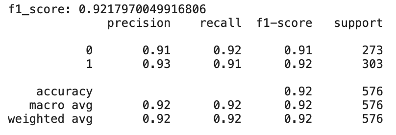

# FakeClassifier - тестовое задание [Контур.](https://kontur.ru)

## To-do list

- [x] Ресерч
- [x] Поиск подходящей модели для дообучения SkolkovoInstitute/russian_toxicity_classifier 
- [x] Эксперименты с лемматизацией и стопсловами
- [x] Подбор параметров
- [x] Создание скриптов для обучения
- [x] Создание скриптов для предсказаний
- [ ] Создание мини-сервиса на flask
- [ ] Docker

## Ресерч (микровыжимка)

**WordCloud**

Я попробовал достаточно много классических моделей

1. TF-IDF + SGD:\

2. TF-IDF + MultinomialNB:\

3. LightAutoML with DeepPavlov Bert:\

Также я эксперементировал со стоп-словами и лемматизацией - ничего хорошего из этого не вышло, но в коде возможность удалять стоп-слова и получать лемматизированные тексты я оставил.

В итоге мой наилучший скор на тестовых данных:

## Инструкция:

- установите необходимые зависимости `pip install -r requirements.txt`
- настройте под себя параметры в `config.yml`, если решаете свою задачу.
- если необходимо, вы можете изменить предобработку данных внутри `solution/data.py`
- модель находится в `solution/model.py`
- Обучение модели `python solution/train.py`
- Запуск из консоли `python solution/predict.py -f [FILE PATH]`
- Или `python solution/predict.py -t [TEXT]`

## Исходный код
* [predictions.tsv](predictions.tsv) - предсказания на тестовых данных от `Контур`
* [config.yml](config.yml) - параметры предобработки, обучения модели и другие
* [dataset/](dataset/) - содержит датасеты для обучения и тестирования задачи от `Контур`
* [img/](img/) - скрины с метриками по ранее использованным моделям
* [solution/data.py](solution/data.py) - внутри находится функция для подготовки данных к `обучению`
* [solution/model.py](solution/model.py) - модель для обучения
* [solution/train.py](solution/train.py) - скрипт для обучения модели и предсказания на тестовых данных
* [solution/evaluating.py](solution/evaluating.py) - функции для вывода метрик и создания предсказания на новых данных
* [solution/predict.py](solution/predict.py) - скрипт для использования предобученной модели из `train.py` по `инструкции` выше
* [solution/utils.py](solution/utils.py) - логика обработки текстов и некоторые дополнительные функции
* [solution/rubert_and_catalyst.ipynb](solution/rubert_and_catalyst.ipynb) - ноутбук с обучением модели и созданием всей логики будущего скрипта
* [solution/UsingByTerminal.ipynb](solution/UsingByTerminal.ipynb) - пример использования скриптов
